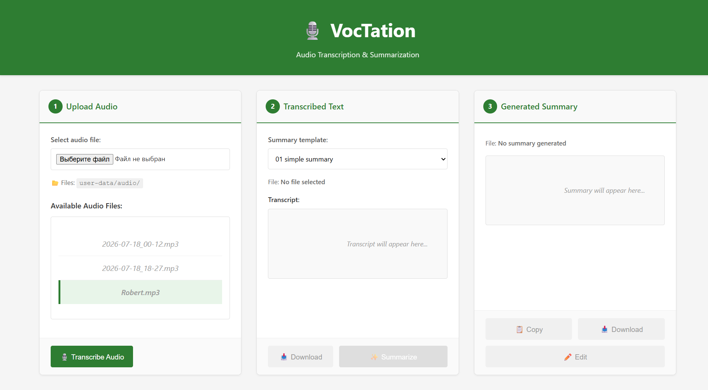

# VocTation

Convert audio to text, then transform text into structured summaries. Simple, fast, offline-first.

## What It Does

1. **Upload** an audio file (MP3, WAV, M4A, OGG, FLAC)
2. **Transcribe** it to text using local AI (Whisper)
3. **Summarize** with custom templates using Gemini AI

## Screenshots


.png)
.png)

## Quick Start

### Windows

**First time?** Double-click `install.bat`

**Ready to go?** Double-click `run.bat` → Visit `http://127.0.0.1:8000`

### macOS/Linux

```bash
python -m venv venv
source venv/bin/activate
pip install -r requirements.txt
python main.py
```

## Setup (2 steps)

1. Get API Key: [Google Gemini API](https://makersuite.google.com/app/apikey)
2. Add to `.env`: `GEMINI_API_KEY=your_key_here`

## How to Use

1. **Upload** - Select audio file
2. **Transcribe** - Click button, wait for text
3. **Summarize** - Pick template, click button
4. **Download** - Copy or download results

## System Requirements

- Python 3.12+
- 4GB RAM minimum
- 2GB disk space (for AI models)
- Internet (Gemini summarization only)

## Batch Files (Windows)

**`install.bat`** - Setup everything once
- Creates virtual environment
- Installs dependencies
- Sets up `.env`

**`run.bat`** - Start the server
- Activates environment
- Runs server at `http://127.0.0.1:8000`

## Troubleshooting

**Port already in use** → Close other `run.bat` instances or restart

**API key error** → Check `.env` file exists and key is correct

**Slow transcription** → First run downloads AI model (~500MB), later runs are faster

**Summarization fails** → Check internet connection and API quota

## Tech

- Backend: FastAPI
- Speech-to-Text: Faster-Whisper (local)
- Summarization: Google Gemini API
- Frontend: HTML/CSS/JavaScript

## License

MIT
