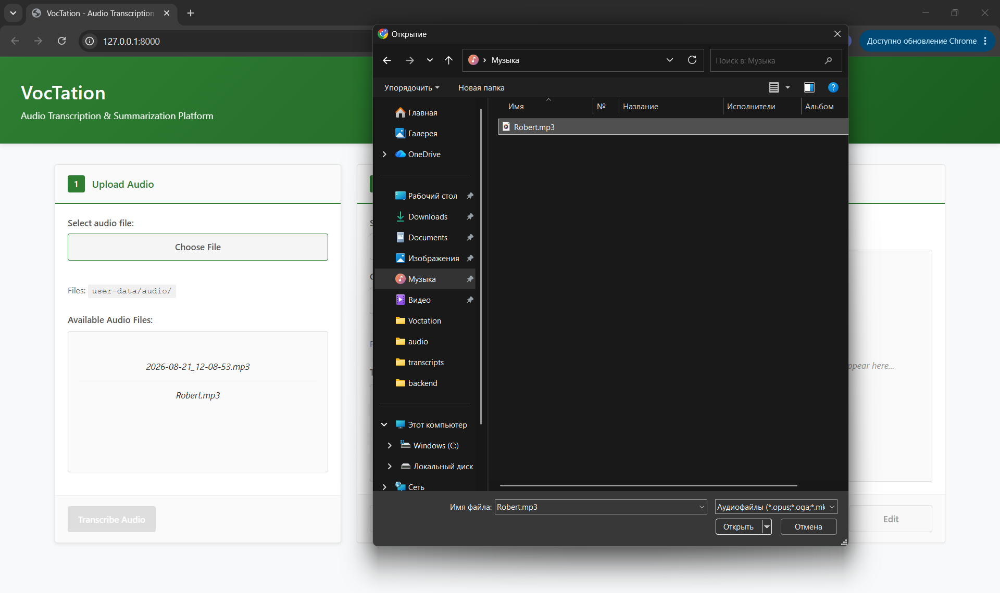
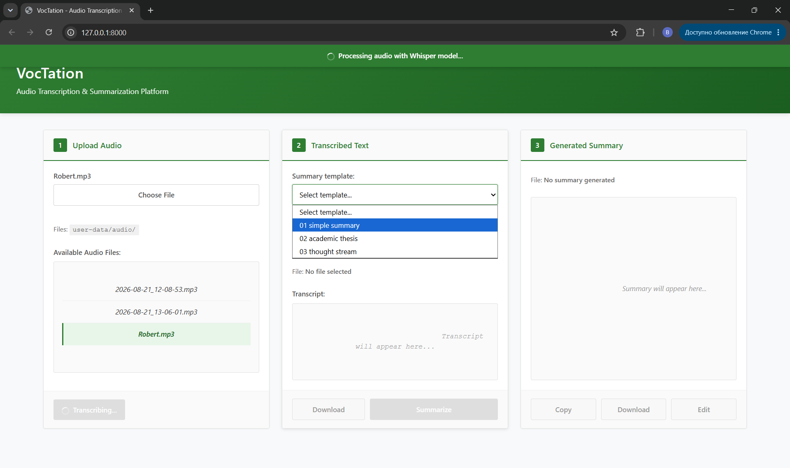
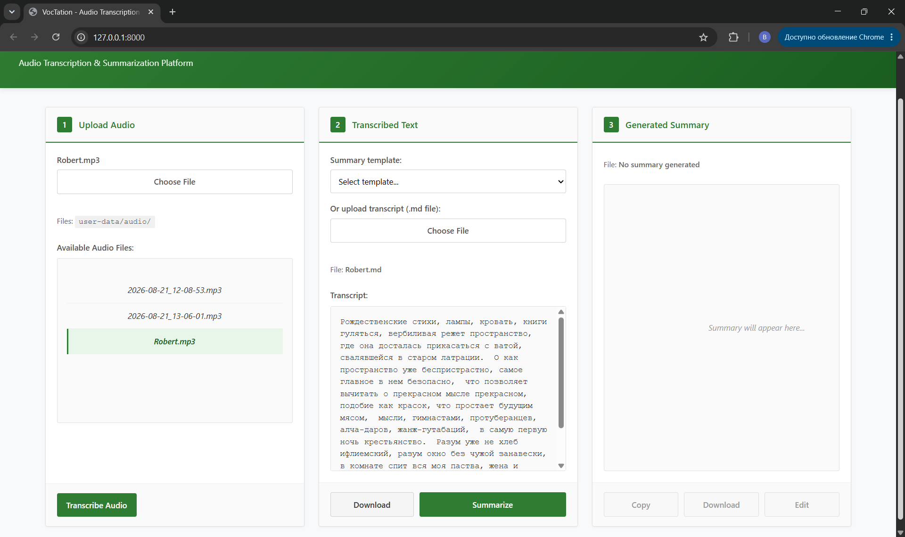
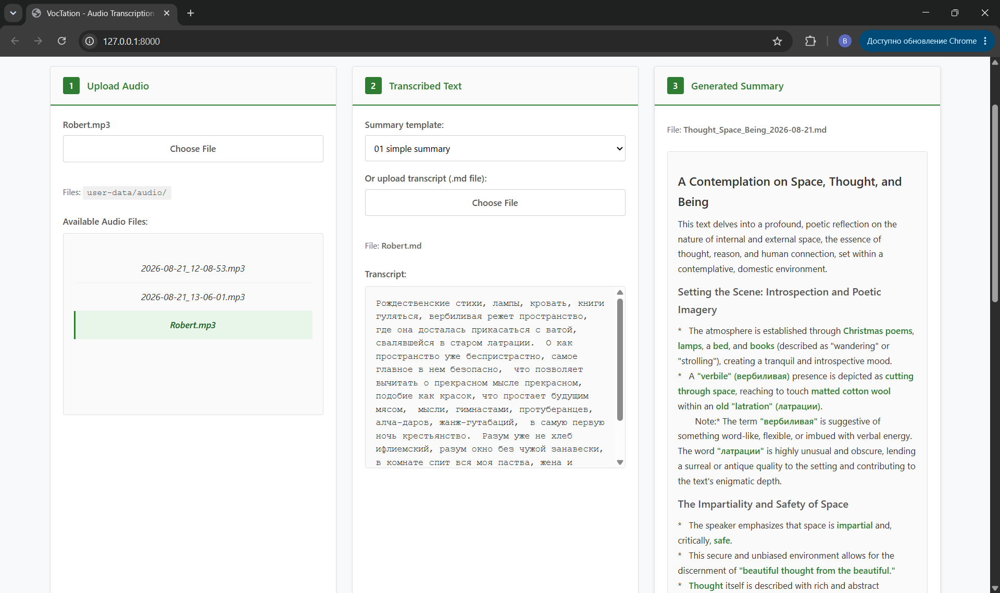

# VocTation

**Audio Transcription & Summarization Platform**

VocTation is a web-based application that transcribes audio files using OpenAI's Whisper model (via `faster-whisper`) and generates structured summaries using Google's Gemini AI. Built with FastAPI and vanilla JavaScript, it provides a clean, professional interface for processing audio recordings into formatted markdown documents.

---

## Screenshots

### 1. Initial State - Audio File Selection


### 2. Processing State - Active Transcription


### 3. Transcribed Text Output


### 4. Generated Markdown Summary


---

## Quick Start (Windows)

### Prerequisites
- Python 3.10 or higher
- Google Gemini API key ([Get one here](https://makersuite.google.com/app/apikey))

### Installation

1. **Clone the repository:**
   ```bash
   git clone https://github.com/yourusername/voctation.git
   cd voctation
   ```

2. **Run the installation script:**
   ```bash
   install.bat
   ```
   This will:
   - Create a Python virtual environment
   - Install all dependencies
   - Set up the required folder structure
   - Create a `.env` file from the template

3. **Configure your API key:**
   - Open `.env` file
   - Add your Gemini API key:
     ```
     GEMINI_API_KEY=your_actual_api_key_here
     ```

4. **Start the server:**
   ```bash
   run.bat
   ```

5. **Open your browser:**
   - Navigate to `http://127.0.0.1:8000`
   - Upload an audio file or select an existing one
   - Click "Transcribe Audio" to generate a transcript
   - Select a summary template and click "Summarize" to generate a formatted output

---

## Manual Setup

If you prefer manual installation:

```bash
# Create virtual environment
python -m venv venv

# Activate virtual environment
venv\Scripts\activate.bat

# Install dependencies
pip install -r requirements.txt

# Create folder structure
mkdir user-data\audio user-data\transcripts user-data\outlines user-data\prompts models\whisper logs

# Copy environment template
copy .env.example .env

# Edit .env and add your GEMINI_API_KEY

# Run the application
python main.py
```

---

## Features

- **Audio Transcription**: Uses Whisper `small` model for accurate speech-to-text conversion
- **AI Summarization**: Leverages Gemini 2.5 Flash for intelligent content summarization
- **Template System**: Customizable prompt templates for different summarization styles
- **Clean UI**: Professional, enterprise-style interface with real-time process indicators
- **File Management**: Organized storage for audio files, transcripts, and summaries
- **Markdown Output**: Generated summaries are formatted in markdown for easy editing

---

## Project Structure

```
voctation/
├── main.py                 # FastAPI application & API endpoints
├── requirements.txt        # Python dependencies
├── .env.example           # Environment variables template
├── install.bat            # Automated installation script
├── run.bat                # Quick launch script
├── static/
│   └── js/
│       ├── app.js         # Frontend logic & UI interactions
│       └── marked.min.js  # Markdown parser
├── templates/
│   └── index.html         # Main application interface
└── user-data/
    ├── audio/             # Uploaded audio files
    ├── transcripts/       # Generated transcripts
    ├── outlines/          # AI-generated summaries
    └── prompts/           # Summarization templates
```

---

## Technologies

- **Backend**: FastAPI, Python 3.10+
- **AI Models**: 
  - Whisper (faster-whisper) for transcription
  - Google Gemini 2.5 Flash for summarization
- **Frontend**: Vanilla JavaScript, HTML5, CSS3
- **Server**: Uvicorn (ASGI)

---

## Requirements

- Python 3.10+
- ~500MB disk space for Whisper model (downloaded on first run)
- Google Gemini API key
- Stable internet connection (for model downloads and API calls)

---

## License

MIT License - feel free to use and modify for your projects.

---

## Support

For issues or questions, please open an issue on GitHub.
